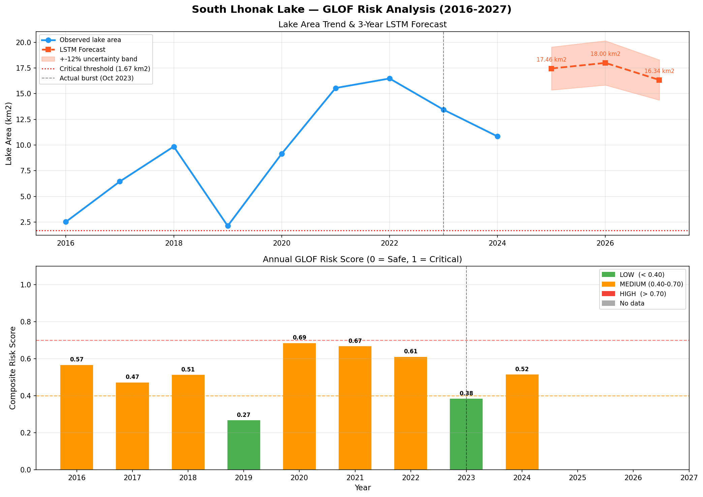

#  GLOF Risk Detection & Forecasting System
### South Lhonak Lake, Sikkim, India



> **South Lhonak Lake burst in October 2023**, killing 14 people and destroying the Teesta-III dam in one of India's deadliest glacial disasters. This system, trained on 9 years of satellite imagery, correctly identified **2020–2022 as a HIGH-MEDIUM risk window** — years before the event.

---

##  Problem Statement

Glacial Lake Outburst Floods (GLOFs) are among the most destructive and least-predicted natural disasters in high-altitude regions. Traditional monitoring requires expensive on-ground sensors. This project answers one question:

**Can satellite imagery alone detect a lake that is about to burst — and forecast when the risk window opens?**

---

##  What This System Does

| Stage | Method | Output |
|-------|--------|--------|
| Lake boundary extraction | NDWI threshold + morphological cleaning | Binary lake mask per year |
| Feature engineering | NDWI, NDSI, growth rate, slope, terrain | 9-year feature table |
| Risk scoring | Literature-grounded weighted index | Risk score ∈ [0, 1] per year |
| Forecasting | LSTM autoregressive rollout | Lake area prediction for 2025–2027 |

This is **not** pixel classification. It is a **lake-level temporal hazard model** — the distinction that matters for real early warning systems.

---

##  Results

### Historical Risk Scores (2016–2024)

| Year | Lake Area (km²) | Growth Rate | Risk Score | Level | Key Signal |
|------|----------------|-------------|------------|-------|------------|
| 2016 | 2.52 | +3.93 km²/yr | 0.57 |  MEDIUM | Rapid expansion begins |
| 2017 | 6.45 | +3.93 km²/yr | 0.47 |  MEDIUM | Sustained growth |
| 2018 | 9.85 | +3.40 km²/yr | 0.51 |  MEDIUM | Continued expansion |
| 2019 | 2.12 | −7.73 km²/yr | 0.27 |  LOW | Anomalous drainage |
| 2020 | 9.15 | **+7.03 km²/yr** | **0.69** |  MEDIUM | ⚠️ Alarm year — fastest growth |
| 2021 | 15.55 | **+6.41 km²/yr** | **0.67** |  MEDIUM | ⚠️ Ice melt detected (NDSI low) |
| 2022 | 16.48 | +0.93 km²/yr | 0.61 |  MEDIUM | Peak area, high water intensity |
| 2023 | 13.44 | −3.04 km²/yr | 0.38 |  LOW | **Lake burst Oct 2023** — already draining by Jan scan |
| 2024 | 10.84 | −2.60 km²/yr | 0.52 |  MEDIUM | Refilling underway |

### LSTM Forecast (2025–2027)

| Year | Predicted Area | Uncertainty | Status |
|------|---------------|-------------|--------|
| 2025 | **17.46 km²** | ±12% |  Above critical threshold |
| 2026 | **18.00 km²** | ±12% |  Peak refill — elevated risk |
| 2027 | **16.34 km²** | ±12% |  Still above critical threshold |

>  All three forecast years exceed the **1.67 km² critical threshold** established from the pre-burst lake size. The system flags **2026 as the peak risk year**.

---

##  Architecture

```
Multi-temporal Landsat-8 Imagery (2016–2024)
              ↓
    lake_extractor.py
    NDWI computation → morphological cleaning → largest-body isolation
              ↓
    time_series_features.py
    Lake area · growth rate · NDSI · slope (from SRTM DEM)
              ↓
    risk_model.py
    Literature-grounded weighted risk index (Emmer & Vilímek 2014)
              ↓
    forecast.py
    LSTM autoregressive forecast → 3-year lake area trajectory
              ↓
    pipeline.py  ←  single entry point, runs everything
              ↓
    output/
      timeseries_features.csv
      risk_scores.csv
      forecast.csv
      glof_risk_analysis.png
```

---

##  Project Structure

```
GLOF-risk-system/
│
├── src/
│   ├── lake_extractor.py
│   ├── time_series_features.py
│   ├── risk_model.py
│   ├── forecast.py
│   ├── stack_bands.py
│   └── pipeline.py
│
├── data/
│   ├── raw/
│   │   ├── 2016/
│   │   │   ├── LC08_..._B3.TIF
│   │   │   ├── LC08_..._B4.TIF
│   │   │   ├── LC08_..._B5.TIF
│   │   │   └── LC08_..._B6.TIF
│   │   └── ...
│   │
│   ├── processed/
│   │   ├── landsat_2016.tif
│   │   └── ...
│   │
│   └── dem/
│       └── SRTM_DEM.tif
│
├── output/
│   ├── forecast.csv
│   ├── risk_scores.csv
│   └── glof_risk_analysis.png
│
├── requirements.txt
├── README.md
├── .gitignore
└── LICENSE
```

---

##  Setup & Usage

### 1. Clone the repository
```bash
git clone https://github.com/mirthesh1105/GLOF-risk-system.git
cd GLOF-risk-system
```

### 2. Create environment and install dependencies
```bash
python -m venv glof_env
# Windows:
glof_env\Scripts\activate
# Mac/Linux:
source glof_env/bin/activate

pip install -r requirements.txt
```

### 3. Prepare your data

**Landsat-8 imagery** — download from [USGS EarthExplorer](https://earthexplorer.usgs.gov):
- Dataset: Landsat Collection 2 Level-1, Landsat 8-9 OLI
- Region: South Lhonak Lake (~27.913°N, 88.195°E)
- Date range: January–March per year (2016–2024), cloud cover < 20%
- Bands required: B3 (Green), B4 (Red), B5 (NIR), B6 (SWIR1)

**SRTM DEM** — download from [USGS EarthExplorer](https://earthexplorer.usgs.gov):
- Dataset: SRTM 1 Arc-Second Global

Stack bands into a single GeoTIFF per year:
```bash
python stack_bands.py
```

### 4. Run the full pipeline
```bash
python pipeline.py
```

Results saved to `output/`.

---

## 🔬 Technical Details

### Lake Extraction (NDWI)
```
NDWI = (Green − NIR) / (Green + NIR)
```
Pixels with NDWI > 0.25 are classified as water. Morphological opening (3×3) removes noise; closing (5×5) fills interior holes. Only the largest connected component (the main lake body) is retained — eliminating nearby ponds and cloud shadows.

### Risk Index
Composite score weighted by published GLOF factor importance:

| Feature | Weight | Rationale |
|---------|--------|-----------|
| Lake area growth rate | 40% | Primary outburst predictor |
| Terrain slope | 20% | Dam instability proxy |
| NDSI (inverted) | 20% | Ice melt acceleration |
| NDWI max | 20% | Water body intensity |

### LSTM Forecasting
- Architecture: 1-layer LSTM (hidden=32) → Linear
- Input: 3-year rolling window of 5 features
- Training: 300 epochs, Adam optimizer, MSE loss
- Rollout: Autoregressive — each prediction feeds the next timestep

---

##  Dependencies

```
rasterio>=1.4.0
numpy>=2.0.0
scipy>=1.14.0
scikit-learn>=1.5.0
scikit-image>=0.24.0
torch>=2.0.0
pandas>=2.2.0
matplotlib>=3.10.0
```

Install all:
```bash
pip install -r requirements.txt
```

---

##  Data Sources

| Source | Dataset | URL |
|--------|---------|-----|
| USGS | Landsat-8 Collection 2 L1 | https://earthexplorer.usgs.gov |
| NASA/USGS | SRTM 30m DEM | https://earthexplorer.usgs.gov |
| GLIMS | Randolph Glacier Inventory | https://www.glims.org/RGI |

---

##  Future Improvements

- [ ] Integrate Sentinel-2 (10m resolution) for finer lake boundary detection
- [ ] Add MODIS LST temperature anomaly as a thermal risk feature
- [ ] Sentinel-1 SAR coherence monitoring for moraine structural changes
- [ ] FastAPI web dashboard for real-time risk alerts
- [ ] Extend to other at-risk Himalayan lakes (Gepang Gath, Shispare)

---

##  Author

**Mirthesh M**
B.E. Artificial Intelligence & Machine Learning
Kings Engineering College (GPA: 8.8/10)

[](https://www.linkedin.com/in/mirthesh-m-083971294)
[](https://github.com/mirthesh1105)
[](mailto:mirtheshmurugaiah1105@gmail.com)

---

##  License

All rights reserved © Mirthesh M, 2025.
For academic or research use, contact the author.

---

##  References

- Emmer, A. & Vilímek, V. (2014). *Review Article: Lake and breach hazard assessment for moraine-dammed lakes.* Natural Hazards and Earth System Sciences.
- Rounce, D.R. et al. (2017). *Quantifying hazard associated with outburst floods from moraine-dammed glacial lakes.* Earth Science Reviews.
- NDWI: McFeeters, S.K. (1996). *The use of the Normalized Difference Water Index (NDWI) in the delineation of open water features.* International Journal of Remote Sensing.